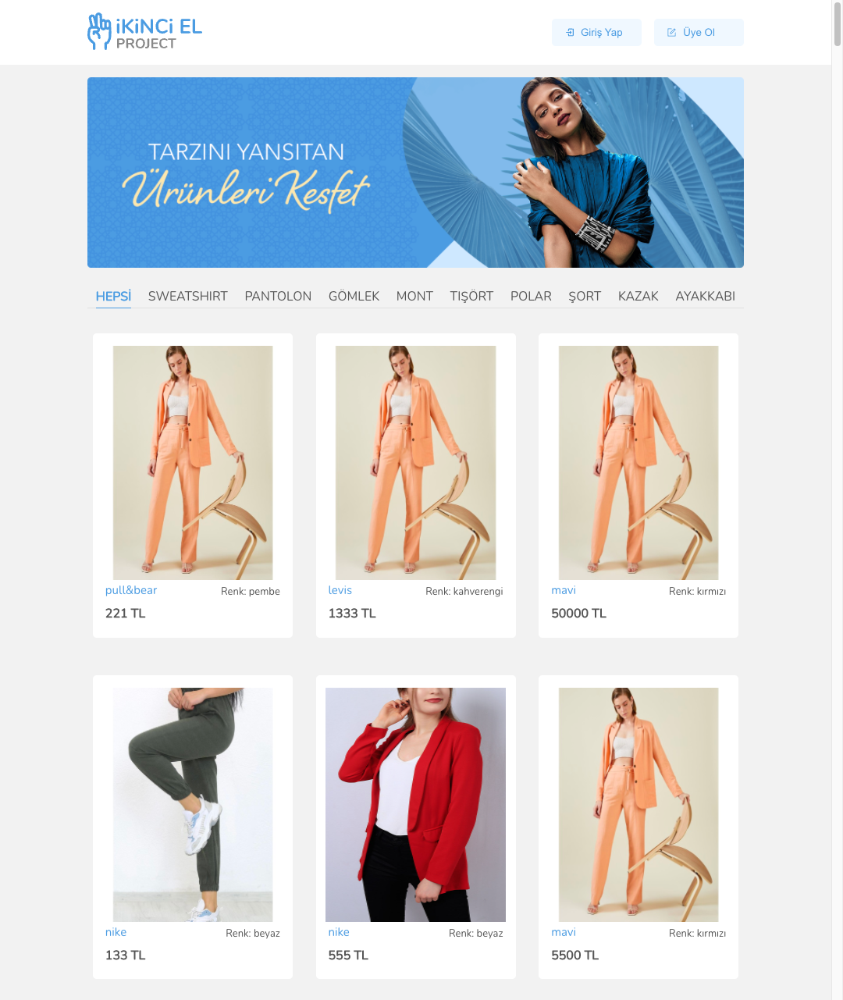
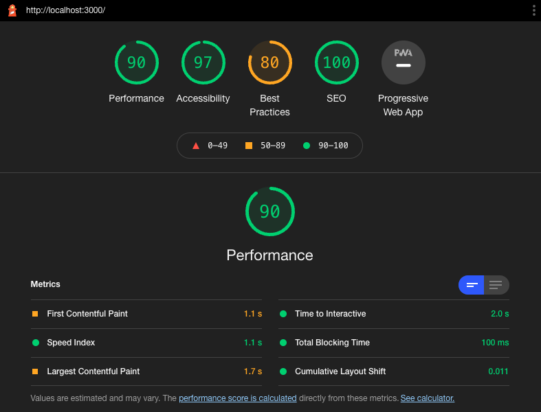
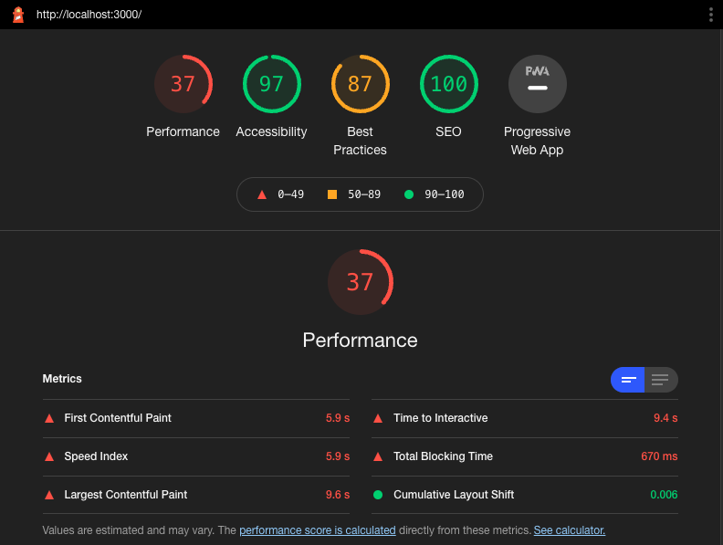

<!-- PROJECT LOGO -->
<br />
<div align="center">
    
</div>
<br />
<br />

<!-- TABLE OF CONTENTS -->
<details>
  <summary>Table of Contents</summary>
  <ol>
    <li>
      <a href="#about-the-project">About The Project</a>
      <ul>
        <li><a href="#built-with">Built With</a></li>
      </ul>
    </li>
    <li>
      <a href="#getting-started">Getting Started</a>
      <ul>
        <li><a href="#prerequisites">Prerequisites</a></li>
        <li><a href="#installation">Installation</a></li>
        <li><a href="#available-scripts">Available Scripts</a></li>
        <li><a href="#performance">Performance</a></li>
      </ul>
    </li>
    <li><a href="#license">License</a></li>
    <li><a href="#contact">Contact</a></li>
    <li><a href="#acknowledgments">Acknowledgments</a></li>
  </ol>
</details>

<!-- ABOUT THE PROJECT -->

## About The Project

<div id="top" align="center">
    
  <h3>İkinci El Project</h3>
  </div>

Ikinci El is the project I developed as a graduation project at the end of the 125th React Bootcamp training carried out by Çiçeksepeti and Patika.dev.

<p align="right">(<a href="#top">back to top</a>)</p>

### Built With

- [React.js](https://reactjs.org/)
- [Redux](https://redux.js.org/)
- [Redux Thunk](https://github.com/reduxjs/redux-thunk)
- [Styled Components](https://styled-components.com/) (With Sass)

<p align="right">(<a href="#top">back to top</a>)</p>

<!-- GETTING STARTED -->

## Getting Started

### Prerequisites

- [Node.js](https://nodejs.org/en/download/)
- [yarn](https://yarnpkg.com/) or npm

### Installation

Clone the repo

```sh
git clone https://github.com/haguse/Ikinci-El-Project.git
```

<br/>

Install packages

`yarn` or `npm install`

<br/>

Start

`yarn start` or `npm start`
<br/>

### Available Scripts

In the project directory, you can run:

#### `yarn test`

Launches the test runner in the interactive watch mode.\
See the section about [running tests](https://facebook.github.io/create-react-app/docs/running-tests) for more information.

#### `yarn build`

Builds the app for production to the `build` folder.\
It correctly bundles React in production mode and optimizes the build for the best performance.

The build is minified and the filenames include the hashes.\
Your app is ready to be deployed!

See the section about [deployment](https://facebook.github.io/create-react-app/docs/deployment) for more information.

### Performance

##### Desktop



##### Mobile



<p align="right">(<a href="#top">back to top</a>)</p>

<!-- LICENSE -->

## License

Distributed under the MIT License. See `LICENSE.txt` for more information.

<p align="right">(<a href="#top">back to top</a>)</p>

<!-- CONTACT -->

## Contact

Halit Güven Serin - [Personal Website](https://halitguvenserin.com) - halitguvens@gmail.com

<p align="right">(<a href="#top">back to top</a>)</p>

<!-- ACKNOWLEDGMENTS -->

## Acknowledgments

- [Patika](https://www.patika.dev/)
- [Ciceksepeti.com / Lolaflora.com](https://www.ciceksepeti.com/)
- [Caglayan Yanikoglu](https://github.com/CaglayanYanikoglu)
- Bootcamp Assistants

<p align="right">(<a href="#top">back to top</a>)</p>
